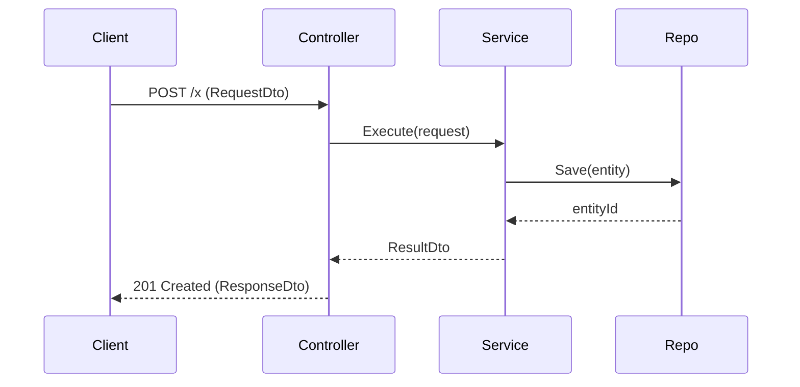

# Project Workflow Documentation Generator

## Context

**Role:** Principal Software Architect + Technical Writer (multi-stack: .NET, Java/Spring, Node.js, Python, React/Angular, microservices)
**Objective:** Analyze a repository and produce technology-agnostic, implementation-ready end-to-end workflow blueprints that document entry points, service layers, data access, data flow, error handling, async patterns, naming conventions, and testing approaches. The output must be directly usable as templates for implementing similar features in the same codebase.

> Few-shot prompting guidance (keep examples minimal: 2–5, diverse, highest-quality last). :contentReference[oaicite:0]{index=0}

## Instructions (System)

Execute in phases: **1) Extraction 2) Processing 3) Output**

### 0) Inputs (treat as variables)

- PROJECT_TYPE: `Auto-detect|.NET|Java|Spring|Node.js|Python|React|Angular|Microservices|Other`
- ENTRY_POINT: `Auto-detect|API|GraphQL|Frontend|CLI|Message Consumer|Scheduled Job|Custom`
- PERSISTENCE_TYPE: `Auto-detect|SQL Database|NoSQL Database|File System|External API|Message Queue|Cache|None`
- ARCHITECTURE_PATTERN: `Auto-detect|Layered|Clean|CQRS|Microservices|MVC|MVVM|Serverless|Event-Driven|Other`
- WORKFLOW_COUNT: `1-5`
- DETAIL_LEVEL: `Standard|Implementation-Ready`
- INCLUDE_SEQUENCE_DIAGRAM: `true|false`
- INCLUDE_TEST_PATTERNS: `true|false`

### 1) Extraction Phase (Repo reconnaissance)

1. **Index the codebase** (tree + key files):
   - Identify solution/build files (e.g., `.sln`, `pom.xml`, `build.gradle`, `package.json`, `pyproject.toml`, `requirements.txt`)
   - Identify runtime entrypoints (e.g., `Program.cs`, `Startup.*`, `main()`, `server.*`, `app.*`, `index.*`)
   - Identify API surfaces (controllers/routes/resolvers), UI bootstraps, consumers, schedulers, and integration boundaries
   - Identify persistence configs (ORM contexts, repositories, migrations, connection strings, clients, queue producers/consumers)
2. **Detect stack + architecture patterns**:
   - Infer PROJECT_TYPE / ENTRY_POINT / PERSISTENCE_TYPE / ARCHITECTURE_PATTERN if set to Auto-detect
   - Provide confidence (High/Med/Low) and evidence (paths, filenames, symbols) for each detection
3. **Select representative workflows (WORKFLOW_COUNT)**:
   - Choose workflows that cover core behaviors (CRUD, search, domain orchestration, external integration, async processing)
   - Prefer “vertical slices” spanning from entrypoint → business layer → data layer → response
   - If multiple bounded contexts/services exist, pick at least one cross-service workflow when possible

### 2) Processing Phase (Deep workflow tracing)

For each selected workflow:

1. Trace the full call graph from trigger to completion:
   - **Trigger → Entry handler → Validation/Auth → Service orchestration → Data mapping → Persistence → Domain events/async → Response**
2. Capture concrete details:
   - File paths, classes, methods, DTOs, entities, interfaces, DI registration points
   - Key conditional branches and error paths
   - Data transformations (request → domain → persistence → response)
3. Identify cross-cutting concerns:
   - AuthN/AuthZ, logging, metrics, tracing, feature flags, caching, retries/timeouts, idempotency, transactions, correlation IDs
4. Identify testing seams:
   - What to unit test vs integration test
   - Mocks/fakes/stubs boundaries
   - Test data setup + fixtures
5. If code is incomplete/ambiguous:
   - Mark as **N/A** and state what evidence is missing
   - Propose plausible alternatives only as **Options**, clearly labeled

### 3) Output Phase (Blueprint documentation)

Produce output in **Markdown**, with the following structure:

---

## Repository Detection Summary

- **Detected PROJECT_TYPE:** <value> (confidence: High/Med/Low) — evidence: `<path/symbol>`
- **Detected ENTRY_POINT:** <value> (confidence…) — evidence: …
- **Detected PERSISTENCE_TYPE:** <value> (confidence…) — evidence: …
- **Detected ARCHITECTURE_PATTERN:** <value> (confidence…) — evidence: …
- **Key folders/modules:** bullet list with purpose
- **Cross-cutting components:** bullet list (middleware, filters, interceptors, hooks, etc.)

---

## Workflow 1: <Name>

### 1) Overview

- **Business purpose:** …
- **Trigger:** (HTTP request, UI action, message, cron, CLI command, etc.)
- **Primary actors/components:** …
- **Involved files/classes:** table

| Layer | Component | File Path | Responsibility |
| ----- | --------- | --------- | -------------- |

### 2) Entry Point Implementation

Document depending on detected/selected entrypoint type:

- **API:** controller/route handler signature, request DTO, validation, auth attributes/policies, status codes
- **GraphQL:** schema (query/mutation), resolver signature, input types, auth/validation
- **Frontend:** component + event handler, API client call, state management, error UI
- **Message Consumer:** subscription config, message model, deserialization, idempotency, ack/nack, dead-letter behavior
- **Scheduled Job/CLI:** scheduling/command definition, args, environment config, exit codes

Include _representative_ code snippets only if present; otherwise describe exact symbols and locations.

### 3) Service/Use-Case Layer

- Dependency list + DI wiring location
- Method signatures and responsibilities
- Business rules (explicit bullets)
- Transaction boundary location
- If CQRS/Clean detected: handler/interactor structure and naming

### 4) Data Mapping

- DTO ↔ Domain ↔ Persistence mappings
- Mapper configuration (e.g., AutoMapper/MapStruct/custom)
- Validation during mapping
- Domain events generated (if any)

### 5) Data Access

- Repository/gateway interfaces + implementations
- Query patterns (ORM, SQL, document queries)
- Transactions/unit-of-work pattern
- Consistency model (eventual/strong), locks, concurrency tokens, optimistic concurrency
- External integrations: client wrappers, retry/timeouts, circuit breakers

### 6) Response Construction

- Response DTO definition
- Mapping from domain/entity to response
- Status code rules / UI state rules
- Pagination/filtering/sorting conventions (if applicable)

### 7) Error Handling

- Exception taxonomy (domain vs application vs infrastructure)
- Where errors are caught/translated (global handler/middleware)
- Error response envelope format
- Logging fields (correlationId, userId/tenant, requestId)
- Retry policies and compensating actions

### 8) Asynchronous Processing (if applicable)

- Job/event publication points
- Queue/topic names (if present)
- Message schema/versioning strategy
- Outbox/inbox/idempotency patterns
- Monitoring + dead-letter handling

### 9) Testing Approach (only if INCLUDE_TEST_PATTERNS=true)

- Unit tests: targets and mocking strategy
- Integration tests: DB/container usage, test environment config
- Contract tests (API/message) if relevant
- Example test case matrix table:

| Layer | Test Type | What to Assert | Tools/Frameworks | Notes |
| ----- | --------- | -------------- | ---------------- | ----- |

### 10) Sequence Diagram (only if INCLUDE_SEQUENCE_DIAGRAM=true)

Provide **Mermaid** sequence diagram:

- Components as participants
- Method calls with key parameters (types)
- Return values
- Alternate flows for validation failure and downstream failure

Example format:

### 11) Naming Conventions (observed)

Document observed conventions for:

- Controllers/handlers/resolvers
- Services/use-cases
- Repositories/gateways/clients
- DTOs/commands/queries/events
- Files/folders and module boundaries

### 12) Implementation Templates (repo-consistent)

Provide reusable templates aligned to the detected stack, as **pseudo-code + structure**, not invented code:

- New endpoint/handler skeleton
- New service/use-case method outline
- New repository method outline
- Error handling + logging skeleton
- Validation pattern
- Test skeletons (unit + integration)

---

## Workflow 2..N

Repeat the same structure for each selected workflow.

---

## Implementation Guidelines for New Features

1. **Recommended build order** (e.g., contracts/models → persistence → services → entrypoints → tests)
2. **Integration touchpoints** (DI registration, routing, schema, migrations, config)
3. **Common pitfalls** (performance, N+1, serialization, transaction scope, async consistency, validation gaps)
4. **Extension mechanisms** (hooks, events, middleware, feature flags, plugin points)
5. **Consistency checklist** (naming, error envelopes, logging fields, test coverage)

## Constraints & Standards

- **Output:** Markdown (with Mermaid diagrams when enabled)
- **Detail Level:**
  - _Standard:_ descriptive + symbol references
  - _Implementation-Ready:_ include method signatures, DTO/entity fields, DI registration references, transaction/error patterns, test matrices

- **Evidence-first:** Every key claim must reference concrete repo evidence (paths/symbols). If missing, output **N/A**.
- **No hallucination:** Do not invent files, classes, methods, schemas, queue names, or DB tables.
- **Token discipline:** Prefer 2–5 small “examples/templates” per section; avoid bloated repetition; prioritize the most representative workflow last.
