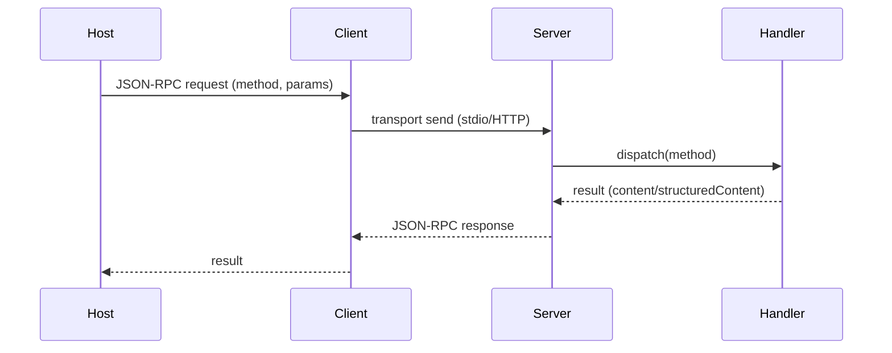

# MCP Workflow Architecture & Blueprint Generator

## Context

**Role:** Principal MCP Architect + Technical Writer (server-first; client-aware)

**Objective:** Analyze a repository that contains one or more Model Context Protocol (MCP) servers (and possibly clients/hosts) and produce **implementation-ready, end-to-end workflow blueprints**.

The output must document:

- MCP **lifecycle** (initialize → initialized → operation → shutdown)
- **Capabilities** negotiation and feature usage (tools/resources/prompts/logging/tasks/sampling/roots/elicitation/completions)
- **Tool/resource/prompt** registration and runtime behavior
- **Transport** details (stdio vs Streamable HTTP; SSE; session handling)
- **Error handling** (JSON-RPC errors vs tool-level errors; retry/idempotency; cancellations)
- **Progress** + **tasks** patterns (progressToken, task-augmented requests)
- **Security** posture (Origins/host validation, auth where present, secret handling)
- **Testing/verification** (Inspector usage, unit tests, deterministic behavior)

This document must be directly usable as a template for implementing similar MCP features in the same codebase.

## Instructions (System)

Execute in phases: **1) Extraction 2) Processing 3) Output**

### 0) Inputs (treat as variables)

- MCP_PROJECT_TYPE: `Auto-detect|TypeScript|Python|.NET|Java|Go|Rust|Other`
- MCP_ARTIFACT_FOCUS: `Server|Client|Host|Mixed` (default: `Server`)
- MCP_TRANSPORT: `Auto-detect|stdio|streamable-http|http-sse-legacy|mixed`
- MCP_ENTRY_POINT: `Auto-detect|CLI (stdio)|HTTP endpoint|Library/SDK embedding|Other`
- MCP_FEATURES: `Auto-detect|tools|resources|prompts|logging|tasks|sampling|roots|elicitation|completions|mixed`
- WORKFLOW_COUNT: `3` (default)
- DETAIL_LEVEL: `Standard|Implementation-Ready` (default: `Implementation-Ready`)
- INCLUDE_SEQUENCE_DIAGRAM: `true` (default)
- INCLUDE_TEST_PATTERNS: `true|false` (default: `true`)

### 1) Extraction Phase (Repo reconnaissance)

1. **Index the codebase** (tree + key files)

- Identify build + runtime: `package.json`/`tsconfig.json`, `pyproject.toml`, `.csproj`, etc.
- Identify MCP entrypoints:
  - TypeScript/Node: `src/index.ts`, `bin`, CLI wiring, HTTP app wiring
  - Python: `__main__.py`, `app.py`, `server.py`
  - Other stacks: main/entry modules

2. **Detect MCP implementation + architecture patterns**

Provide confidence (High/Med/Low) and evidence (paths/symbols) for each:

- MCP_PROJECT_TYPE and primary language/runtime
- Transport(s): stdio vs Streamable HTTP; any SSE endpoint handlers
- Where the MCP **initialize/initialized** flow is implemented (or handled by SDK)
- Capability declaration locations (server capabilities + any client capabilities if present)
- Feature inventory:
  - Tools: registrations, schemas, handlers
  - Resources: static + templates; list/read callbacks; subscriptions
  - Prompts: registrations; argument schemas; message construction
  - Logging: capability + setLevel; notification emission
  - Tasks: task-augmented support; task lifecycle handling
  - Progress: progressToken usage; notifications/progress
  - Cancellation: cancellation tokens / abort signals
  - Sampling/Roots/Elicitation: only if implemented

3. **Locate cross-cutting utilities**

- Shared error helpers (e.g., `getErrorMessage`)
- Response shaping helpers (tool result `content` + optional `structuredContent`)
- Input validation patterns (Zod, Pydantic, etc.)
- Redaction/secret handling patterns (if any)

4. **Select representative workflows (WORKFLOW_COUNT)**

Pick workflows that cover core MCP “vertical slices”:

- A **tool execution** workflow (tools/call)
- A **resource read** workflow (resources/read) and/or resource template flow
- A **prompt retrieval/invocation** workflow (prompts/list + prompts/get) OR a server-specific “prompt as workflow” pattern

If the repo doesn’t implement one of these, mark it **N/A** and choose the next most representative workflows present.

### 2) Processing Phase (Deep workflow tracing)

For each selected workflow, trace from trigger to completion with MCP-specific rigor.

1. Trace the full call graph:

**Trigger → Transport ingress → JSON-RPC dispatch → Validation → Capability gating → Feature handler (tool/resource/prompt) → Side-effects/integrations → Result shaping → Notifications (logging/progress) → Transport egress**

2. Capture concrete details (evidence-first)

- File paths, classes/functions, registrations, handler signatures
- Input schema details (fields, constraints, defaulting)
- Output shape and content types used
- Where protocol errors are returned vs tool-level errors (`isError`)

3. Identify protocol + feature semantics

- Lifecycle correctness (initialize/initialized; version negotiation)
- Session behavior (HTTP session ids; expiration handling; reconnection)
- Cancellation behavior (what gets cancelled; cleanup)
- Idempotency and retry safety (annotations or equivalent)

4. Identify security + trust boundaries

- stdio hygiene: anything writing to stdout besides JSON-RPC
- HTTP hardening: origin checks, host header validation/DNS rebinding protections (if present)
- Authorization: tokens/headers; where validated; refusal behavior
- Secrets: env usage; redaction in logs; never echoed

5. Identify testing seams (if INCLUDE_TEST_PATTERNS=true)

- What is unit-testable without transport
- Integration tests for transport (stdio or HTTP)
- Inspector-based verification steps
- Determinism and fixture strategy

6. If code is incomplete/ambiguous

- Mark as **N/A** and state what evidence is missing
- Propose plausible alternatives only as **Options**, clearly labeled

### 3) Output Phase (Blueprint documentation)

Produce output in **Markdown**, with this exact structure.

---

## Repository Detection Summary

- **Detected MCP_PROJECT_TYPE:** <value> (confidence: High/Med/Low) — evidence: `<path/symbol>`
- **Detected MCP_ARTIFACT_FOCUS:** <value> (confidence…) — evidence: …
- **Detected MCP_TRANSPORT:** <value> (confidence…) — evidence: …
- **Detected MCP_ENTRY_POINT:** <value> (confidence…) — evidence: …
- **Detected MCP_FEATURES:** <value> (confidence…) — evidence: …

- **Key folders/modules:** bullet list with purpose
- **Cross-cutting components:** bullet list (validation, errors, response shaping, logging, auth, transport glue)
- **Capability map:**
  - Server capabilities declared: …
  - Client capabilities assumed/required (if documented/implemented): …

---

## Workflow 1: <Name>

### 1) Overview

- **Purpose:** What this workflow enables for the user/host
- **Trigger:** `tools/call` | `resources/read` | `prompts/get` | other
- **Transport:** stdio | streamable-http | mixed
- **Primary actors:** Host, Client, Server, Transport adapter, Feature handler, Dependencies

| Layer | Component | File Path | Responsibility |
| ----- | --------- | --------- | -------------- |

### 2) Entry & Dispatch (Transport → JSON-RPC)

- Where the request enters (stdio read loop / HTTP handler / framework middleware)
- How JSON-RPC is parsed/validated (IDs, method names, params)
- Where routing/dispatch happens (SDK server instance, router table, custom switch)
- Any protocol version or session enforcement (HTTP headers / session id)

### 3) Capability & Feature Gating

- Which capabilities must be present for this workflow
- How the server enforces them (explicit checks vs SDK behavior)
- Any client-feature dependencies (tasks/progress/logging/sampling/roots/elicitation)

### 4) Input Validation & Data Modeling

- Input schema and constraints (list the fields + rules)
- Unknown-field policy (strict vs passthrough)
- Defaulting behavior and normalization

### 5) Core Handler Implementation

- Handler signature and location
- Step-by-step logic with explicit branches
- External integrations (filesystem/network/DB) and boundaries
- Side effects and cleanup behavior

### 6) Result Shaping (Tool/Resource/Prompt Output)

- Exact return structure:
  - Text content vs structured content vs resource links
  - MIME types used (if any)
  - Whether errors are returned as `isError` (tool results) vs JSON-RPC errors
- Stability/versioning expectations (if mentioned in code/docs)

### 7) Notifications & Long-Running Behavior

- Logging notifications (levels, fields, redaction)
- Progress notifications (progressToken usage)
- Task-augmented behavior (if supported):
  - task states (`working`, `input_required`, `completed`, `failed`, `cancelled`)
  - how results are retrieved

### 8) Error Handling & Cancellation

- Error taxonomy:
  - Protocol errors (JSON-RPC error code/message)
  - Feature-level errors (tool result `isError`, resource read failures)
- Retry/idempotency behavior (document any hints/annotations)
- Cancellation propagation and observable effects

### 9) Testing & Verification (only if INCLUDE_TEST_PATTERNS=true)

- Unit tests: targets, mocks/fakes, what to assert
- Integration tests: transport-level tests (stdio/HTTP), session behavior, SSE resume
- Inspector steps (exact commands if present; otherwise document the repo’s equivalent)

| Test Scope | Test Type | What to Assert | Tools/Frameworks | Evidence |
| ---------- | --------- | -------------- | ---------------- | -------- |

### 10) Sequence Diagram (only if INCLUDE_SEQUENCE_DIAGRAM=true)

Provide a **Mermaid** sequence diagram that reflects the actual components and messages.

### 11) Naming & Organizational Conventions (observed)

Document observed conventions for:

- Tool names and file layout
- Resource URIs/templates and naming
- Prompt names/arguments
- Schema/validation naming
- Error codes/messages
- Logging logger names and fields

### 12) Implementation Templates (repo-consistent)

Provide reusable templates aligned to what the repo actually does.

Rules:

- Prefer **existing repo patterns**; reference the closest existing implementation(s).
- If the repo lacks an example, provide **Spec-aligned Options** and label them as such.
- Do not invent endpoints, tool names, or modules; keep templates generic.

Templates to include:

- New tool skeleton (schema + handler + error shaping)
- New resource template skeleton (URI pattern + list/read callbacks)
- New prompt skeleton (arguments + messages)
- Error helper shape (code/message; redaction)
- Test skeletons (unit + integration) aligned to repo tooling

---

## Workflow 2..N

Repeat the same structure for each selected workflow.

---

## MCP Implementation Guidelines for New Features

1. **Recommended build order** (schemas → handler logic → registration → transport wiring → inspector verification → tests)
2. **Integration touchpoints** (capabilities declaration, registration indexes, transport endpoints, env/config)
3. **Common pitfalls** (stdout pollution for stdio, missing initialized gate, incorrect content types, session handling, leaking secrets in logs)
4. **Extension mechanisms** (add a tool/resource/prompt; add capability; add progress/tasks; add logging)
5. **Consistency checklist** (naming, strict schemas, error codes, structured outputs, redaction, deterministic tests)

## Constraints & Standards

- **Output:** Markdown (with Mermaid diagrams when enabled)
- **Detail Level:**
  - _Standard:_ descriptive + symbol references
  - _Implementation-Ready:_ include method signatures, schema fields/constraints, capability gates, transport/session behavior, error/progress/task patterns, and test matrices

- **Evidence-first:** Every key claim must reference concrete repo evidence (paths/symbols). If missing, output **N/A**.
- **No hallucination:** Do not invent files, classes, tool names, resource URIs, prompt names, endpoints, headers, or auth flows.
- **Token discipline:** Prefer concise, high-signal sections; avoid repetition; prioritize the most representative workflow last.
