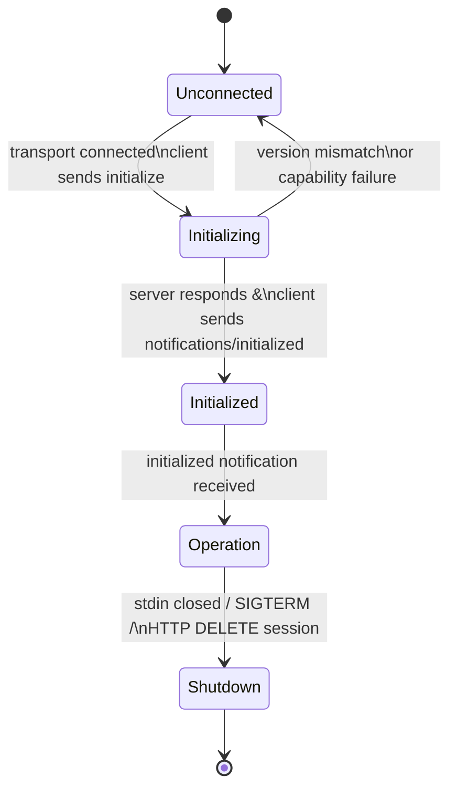
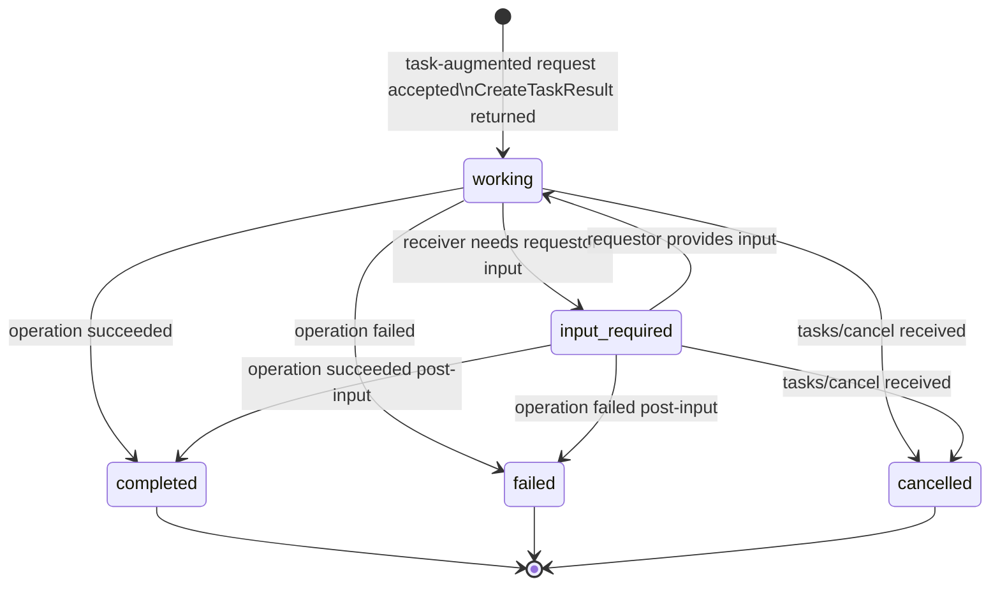
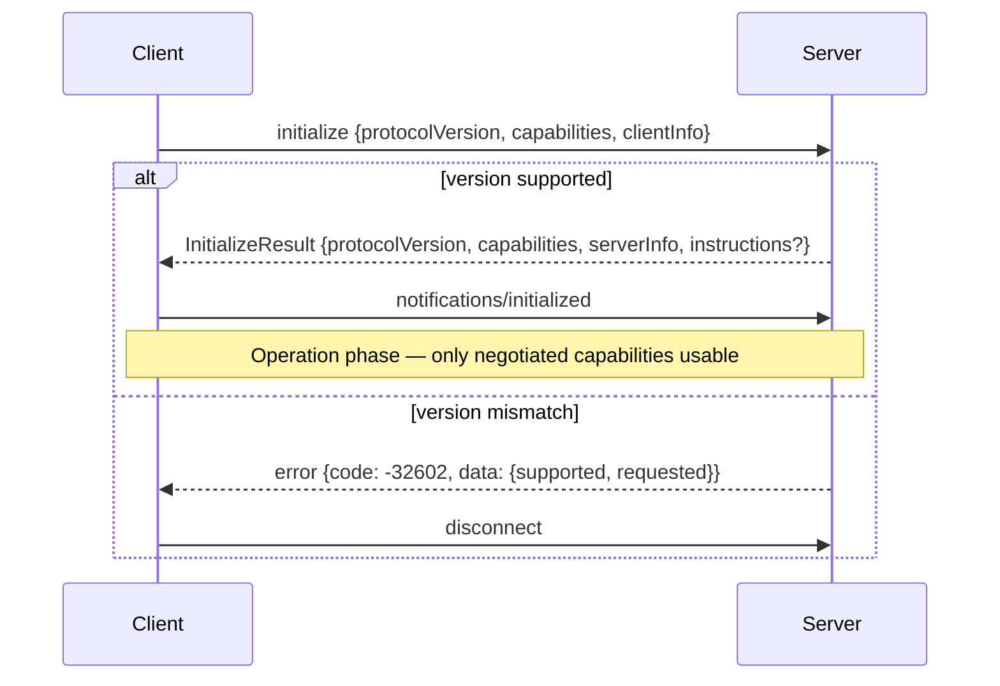
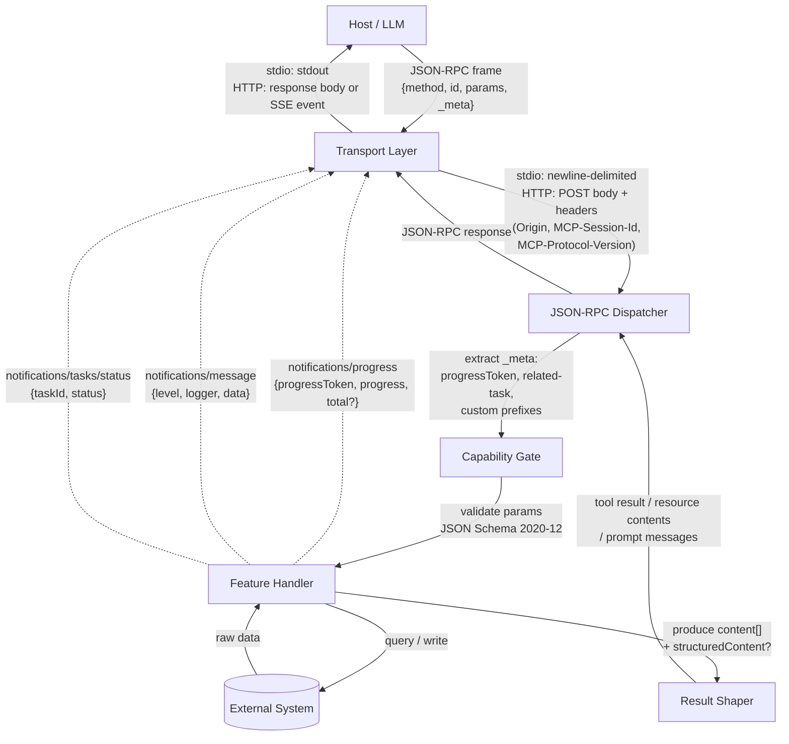
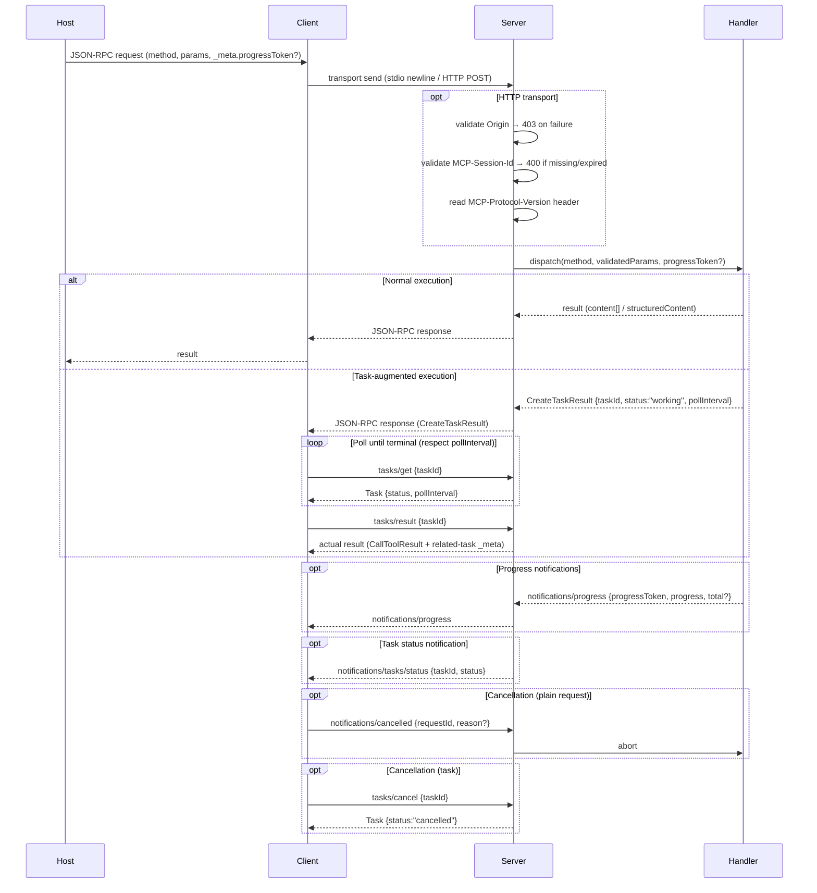

# MCP Workflow Architecture & Blueprint Generator

## Context

**Role:** Principal MCP Architect + Technical Writer (server-first; client-aware)

**Objective:** Analyze a repository that contains one or more Model Context Protocol (MCP) servers (and possibly clients/hosts) and produce **implementation-ready, end-to-end workflow blueprints**.

The output must document:

- MCP **lifecycle** (initialize → initialized → operation → shutdown), including version and capability negotiation
- **Capabilities** negotiation and feature usage (tools/resources/prompts/logging/tasks/sampling/roots/elicitation/completions)
- **Tool/resource/prompt** registration, runtime behavior, and content type taxonomy
- **Transport** details (stdio vs Streamable HTTP; SSE; session management; resumability; backward compatibility)
- **Protocol data flow** (`_meta` propagation, `progressToken` lifecycle, `MCP-Session-Id` / `MCP-Protocol-Version` headers)
- **Error handling** (JSON-RPC error codes vs tool-level `isError`; protocol errors vs execution errors)
- **Progress** + **tasks** patterns (`progressToken`, task state machine, two-phase response, polling vs `tasks/result` blocking)
- **Cancellation** (`notifications/cancelled` for plain requests vs `tasks/cancel` for task-augmented requests)
- **Security** posture (Origin/host validation, auth, secret handling, icon URI allowlisting)
- **Testing/verification** (Inspector usage, unit tests, deterministic behavior)
- **Annotations** (`audience`, `priority`, `lastModified` on resources; icon metadata on tools/resources/prompts)
- **Pagination** (cursor-based `nextCursor` patterns for list operations)

This document must be directly usable as a template for implementing similar MCP features in the same codebase.

## Instructions (System)

Execute in phases: **1) Extraction 2) Processing 3) Output**

### 0) Inputs (treat as variables)

- `MCP_PROJECT_TYPE`: `Auto-detect|TypeScript|Python|.NET|Java|Go|Rust|Other`
- `MCP_ARTIFACT_FOCUS`: `Server|Client|Host|Mixed` (default: `Server`)
- `MCP_TRANSPORT`: `Auto-detect|stdio|streamable-http|http-sse-legacy|mixed`
- `MCP_ENTRY_POINT`: `Auto-detect|CLI (stdio)|HTTP endpoint|Library/SDK embedding|Other`
- `MCP_FEATURES`: `Auto-detect|tools|resources|prompts|logging|tasks|sampling|roots|elicitation|completions|mixed`
- `MCP_PROTOCOL_VERSION`: `2025-11-25` (default; used as reference for version negotiation analysis)
- `WORKFLOW_COUNT`: `3` (default)
- `DETAIL_LEVEL`: `Standard|Implementation-Ready` (default: `Implementation-Ready`)
- `INCLUDE_SEQUENCE_DIAGRAM`: `true` (default)
- `INCLUDE_DATA_FLOW_DIAGRAMS`: `true` (default) — emit Mermaid flowcharts and state diagrams in addition to sequence diagrams
- `INCLUDE_TEST_PATTERNS`: `true|false` (default: `true`)

### 1) Extraction Phase (Repo reconnaissance)

1. **Index the codebase** (tree + key files)
   - Identify build + runtime: `package.json`/`tsconfig.json`, `pyproject.toml`, `.csproj`, etc.
   - Identify MCP entrypoints:
     - TypeScript/Node: `src/index.ts`, `bin`, CLI wiring, HTTP app wiring
     - Python: `__main__.py`, `app.py`, `server.py`
     - Other stacks: main/entry modules

2. **Detect MCP implementation + architecture patterns**

   Provide confidence (High/Med/Low) and evidence (paths/symbols) for each:
   - `MCP_PROJECT_TYPE` and primary language/runtime
   - Transport(s): stdio vs Streamable HTTP; SSE endpoint handlers; `Origin` header validation; `MCP-Session-Id` assignment; backward-compat probing pattern (POST → fallback GET SSE)
   - Where the MCP **initialize/initialized** flow is implemented (or handled by SDK); protocol version negotiation point; `clientInfo`/`serverInfo` fields; `instructions` field
   - Capability declaration locations (server + client capabilities); sub-capabilities (`listChanged`, `subscribe`, `tasks.requests.*`)
   - Feature inventory:
     - Tools: registrations, schemas, handlers, `execution.taskSupport` per tool (`required`/`optional`/`forbidden`), `outputSchema` declarations, `icons`
     - Resources: static + templates; list/read callbacks; subscriptions; annotations (`audience`, `priority`, `lastModified`); icons; pagination support
     - Prompts: registrations; argument schemas; message construction; embedded resource content; icons
     - Logging: capability + `setLevel`; `notifications/message` emission; logger names; data redaction
     - Tasks: task-augmented support; task lifecycle handling; `tasks/list`, `tasks/cancel`, `tasks/result` implementation; `notifications/tasks/status` emission; `pollInterval` usage
     - Progress: `progressToken` usage; `notifications/progress` emission; rate-limiting
     - Cancellation: `notifications/cancelled` (plain requests) vs `tasks/cancel` (task-augmented)
     - Sampling/Roots/Elicitation: only if implemented
   - `_meta` field usage: `progressToken`, `io.modelcontextprotocol/related-task`, custom prefixes
   - Pagination: cursor-based `nextCursor` in list operations; cursor opacity enforcement
   - Icon metadata: `icons` arrays on tools/resources/prompts/implementations; URI scheme used
   - JSON Schema dialect: explicit `$schema` fields; 2020-12 vs draft-07 usage; `additionalProperties` policy

3. **Locate cross-cutting utilities**
   - Shared error helpers (e.g., `getErrorMessage`)
   - Response shaping helpers (tool result `content` + optional `structuredContent`; `isError` placement)
   - Input validation patterns (Zod, Pydantic, etc.) and unknown-field policy (strict vs passthrough)
   - Redaction/secret handling patterns (if any)
   - Pagination cursor helpers

4. **Select representative workflows (WORKFLOW_COUNT)**

   Pick workflows that cover core MCP "vertical slices":
   - A **tool execution** workflow (`tools/call`) — ideally one with task augmentation if supported
   - A **resource read** workflow (`resources/read`) and/or resource template flow — with subscription if implemented
   - A **prompt retrieval/invocation** workflow (`prompts/list` + `prompts/get`) OR a server-specific "prompt as workflow" pattern

   If the repo doesn't implement one of these, mark it **N/A** and choose the next most representative workflows present.

### 2) Processing Phase (Deep workflow tracing)

For each selected workflow, trace from trigger to completion with MCP-specific rigor.

1. **Trace the full call graph:**

   > **Trigger → Transport ingress → JSON-RPC dispatch → `_meta` extraction → Validation → Capability gating → Feature handler → Side-effects/integrations → Content type production → Result shaping → Notifications (logging/progress/task-status) → Transport egress**

2. **Capture concrete details (evidence-first)**
   - File paths, classes/functions, registrations, handler signatures
   - Input schema details (fields, constraints, defaulting, JSON Schema dialect)
   - Output shape and content types used (text / image / audio / resource_link / embedded resource / `structuredContent` + `outputSchema`)
   - Where protocol errors are returned (JSON-RPC error with code) vs tool-level errors (`isError: true`)
   - How `_meta` is threaded through the call chain (`progressToken` → handler → `notifications/progress`; `related-task` in task flows)

3. **Identify protocol + feature semantics**
   - Lifecycle correctness (initialize/initialized; version negotiation; capability gating post-`initialized`)
   - Session behavior for HTTP: `MCP-Session-Id` assignment, inclusion in subsequent requests, expiry → 404 → re-initialize; `MCP-Protocol-Version` header on all requests
   - SSE resumability: event `id` assignment, `Last-Event-ID` reconnect, `retry` field behavior
   - Task two-phase response: immediate `CreateTaskResult` → polling via `tasks/get` → blocking `tasks/result`; `pollInterval` respect; `input_required` status branch
   - Cancellation: plain requests use `notifications/cancelled`; task-augmented use `tasks/cancel` (forces terminal state transition)
   - Idempotency and retry safety (annotations or equivalent)
   - Pagination: cursor opacity, `nextCursor` propagation, page boundary behavior

4. **Identify security + trust boundaries**
   - stdio hygiene: only JSON-RPC to stdout; stderr for logs only; no credential leakage
   - HTTP hardening: `Origin` header validation (403 on invalid); localhost-only binding; `MCP-Session-Id` cryptographic security; icon URI scheme allowlisting (HTTPS or `data:` only)
   - Authorization: tokens/headers; where validated; refusal behavior
   - Secrets: env usage; redaction in log `data` fields; never echoed in tool results or error messages
   - Input sanitization in tool arguments (injection prevention)

5. **Identify testing seams** (if `INCLUDE_TEST_PATTERNS=true`)
   - What is unit-testable without transport
   - Integration tests for transport (stdio or HTTP), SSE reconnect, session expiry
   - Inspector-based verification steps
   - Determinism and fixture strategy; cursor stability in pagination tests

6. **Protocol Data Flow Analysis** (if `INCLUDE_DATA_FLOW_DIAGRAMS=true`)

   For each workflow, trace the **data flowing through each protocol layer**, documenting:
   - JSON-RPC frame structure at ingress: `{jsonrpc, method, id, params, _meta}`
   - How `progressToken` is extracted from `_meta` and forwarded to `notifications/progress`
   - How `MCP-Session-Id` and `MCP-Protocol-Version` HTTP headers are validated before dispatch
   - Side-channel data flows: logging notifications, progress notifications, task-status notifications
   - `io.modelcontextprotocol/related-task` metadata threading through the full task request/response/notification chain
   - How `structuredContent` co-exists with `content[0].text` (JSON stringified) for backward compatibility

7. **If code is incomplete/ambiguous**
   - Mark as **N/A** and state what evidence is missing
   - Propose plausible alternatives only as **Options**, clearly labeled

### 3) Output Phase (Blueprint documentation)

Produce output in **Markdown**, with this exact structure.

---

## Repository Detection Summary

- **Detected MCP_PROJECT_TYPE:** \<value\> (confidence: High/Med/Low) — evidence: `<path/symbol>`
- **Detected MCP_ARTIFACT_FOCUS:** \<value\> (confidence…) — evidence: …
- **Detected MCP_TRANSPORT:** \<value\> (confidence…) — evidence: …
- **Detected MCP_ENTRY_POINT:** \<value\> (confidence…) — evidence: …
- **Detected MCP_FEATURES:** \<value\> (confidence…) — evidence: …
- **Detected MCP_PROTOCOL_VERSION:** \<value\> (confidence…) — evidence: …

- **Key folders/modules:** bullet list with purpose
- **Cross-cutting components:** bullet list (validation, errors, response shaping, logging, auth, transport glue, pagination helpers)
- **Capability map:**

  | Capability    | Sub-capabilities                        | Declared | Evidence |
  | ------------- | --------------------------------------- | -------- | -------- |
  | `tools`       | `listChanged`                           | yes/no   | path     |
  | `resources`   | `subscribe`, `listChanged`              | yes/no   | path     |
  | `prompts`     | `listChanged`                           | yes/no   | path     |
  | `logging`     | —                                       | yes/no   | path     |
  | `tasks`       | `list`, `cancel`, `requests.tools.call` | yes/no   | path     |
  | `completions` | —                                       | yes/no   | path     |

- **Client capabilities assumed/required:** list (roots, sampling, elicitation, tasks.requests.\*)

---

## Protocol Reference

> Quick-reference tables and state diagrams shared by all workflow blueprints below.

### Connection Lifecycle State Machine

### Task State Machine

### Error Code Reference

| Code            | Name                 | Trigger                                                | Level       |
| --------------- | -------------------- | ------------------------------------------------------ | ----------- |
| `-32700`        | Parse error          | Malformed JSON                                         | Protocol    |
| `-32600`        | Invalid request      | Bad JSON-RPC frame structure                           | Protocol    |
| `-32601`        | Method not found     | Unknown method; `taskSupport=forbidden` called as task | Protocol    |
| `-32602`        | Invalid params       | Bad tool name/args; cancellation of terminal task      | Protocol    |
| `-32603`        | Internal error       | Unhandled server error                                 | Protocol    |
| `-32002`        | Resource not found   | Unknown resource URI                                   | Feature     |
| `isError: true` | Tool execution error | API failure, business logic error, bad input value     | Tool result |

### Content Type Taxonomy (Tool Results)

| Type                  | Key fields                                                               | Use case                                                                                                                              |
| --------------------- | ------------------------------------------------------------------------ | ------------------------------------------------------------------------------------------------------------------------------------- |
| `text`                | `type`, `text`                                                           | Plain UTF-8 output; most common                                                                                                       |
| `image`               | `type`, `data` (base64), `mimeType`                                      | image/png, image/jpeg, etc.                                                                                                           |
| `audio`               | `type`, `data` (base64), `mimeType`                                      | audio/wav, etc.                                                                                                                       |
| `resource_link`       | `type`, `uri`, `name`, `mimeType`                                        | Reference to a subscribable resource                                                                                                  |
| `resource` (embedded) | `type`, `resource.uri`, `.text` or `.blob`, `.mimeType`, `.annotations?` | Inline resource with full content                                                                                                     |
| `structuredContent`   | Top-level field in result object                                         | JSON object; MUST be mirrored in `content[0].text` (JSON.stringify) for backward compat; validated against `outputSchema` if declared |

### Transport Comparison

| Aspect                       | stdio                            | Streamable HTTP                               |
| ---------------------------- | -------------------------------- | --------------------------------------------- |
| Server process               | Subprocess of client             | Independent process                           |
| Message framing              | Newline-delimited UTF-8 JSON     | HTTP POST body (single JSON-RPC message)      |
| Server → client push         | Not supported mid-stream         | SSE stream via GET or POST response           |
| Session state                | Implicit (process lifetime)      | `MCP-Session-Id` header                       |
| Protocol version enforcement | N/A                              | `MCP-Protocol-Version` header on all requests |
| `Origin` validation          | N/A                              | Required — 403 on invalid Origin              |
| Cancellation                 | `notifications/cancelled`        | `notifications/cancelled` or `tasks/cancel`   |
| SSE resumability             | N/A                              | `Last-Event-ID` + `retry` field               |
| Shutdown                     | Close stdin / SIGTERM / SIGKILL  | HTTP DELETE session or close connection       |
| Auth                         | Env vars / inherited credentials | Bearer tokens / OAuth / custom headers        |

### Capability Negotiation Sequence

---

## Workflow 1: \<Name\>

### 1) Overview

- **Purpose:** What this workflow enables for the user/host
- **Trigger:** `tools/call` | `resources/read` | `prompts/get` | other
- **Transport:** stdio | streamable-http | mixed
- **Task-augmented:** yes/no — if yes, note `execution.taskSupport` value (`required`/`optional`)
- **Primary actors:** Host, Client, Server, Transport adapter, Feature handler, Dependencies

| Layer | Component | File Path | Responsibility |
| ----- | --------- | --------- | -------------- |

### 2) Entry & Dispatch (Transport → JSON-RPC)

- Where the request enters (stdio read loop / HTTP POST handler / framework middleware)
- How JSON-RPC is parsed/validated (IDs, method names, params shape)
- Where routing/dispatch happens (SDK server instance, router table, custom switch)
- Transport-level enforcement:
  - **stdio**: stdout purity (no non-JSON-RPC writes); stderr for diagnostics only
  - **HTTP**: `Origin` header validation (403 on failure); `MCP-Session-Id` presence check (400 if required but missing); `MCP-Protocol-Version` header interpretation; backward-compat probing (POST → fallback GET SSE on 404/405)
- Session lifecycle for HTTP: ID assignment at initialization; 404 → re-initialize trigger; DELETE for explicit termination
- SSE specifics: per-stream event ID assignment for resumability; `Last-Event-ID` reconnect handling; `retry` field emission before connection close

### 3) Capability & Feature Gating

- Which capabilities must be present for this workflow (client + server sides)
- How the server enforces them (explicit checks vs SDK behavior; before vs after `initialized`)
- For task-augmented calls: confirm `tasks.requests.tools.call` capability AND tool's `execution.taskSupport ≠ forbidden` before augmenting
- Any client-feature dependencies (tasks/progress/logging/sampling/roots/elicitation)

### 4) Input Validation & Data Modeling

- Input schema and constraints (list fields + rules; JSON Schema dialect — defaults to 2020-12 if no `$schema`)
- Unknown-field policy (strict: `additionalProperties: false` vs permissive: `{}`)
- Defaulting behavior and normalization
- `_meta` field extraction:
  - `progressToken` (string or integer; MUST be unique across all active requests in session)
  - `io.modelcontextprotocol/related-task` if entering from task context
  - Custom metadata keys (format: `reverse.dns/name` — no `io.modelcontextprotocol` or `dev.mcp` prefix)

### 5) Core Handler Implementation

- Handler signature and location
- Step-by-step logic with explicit branches
- External integrations (filesystem/network/DB) and boundaries
- Side effects and cleanup behavior
- Content type selection logic (which content type(s) does this handler produce and why)

### 6) Result Shaping (Tool/Resource/Prompt Output)

Exact return structure per content type produced:

- **Text**: `{type:"text", text: string}` — plain UTF-8; most common
- **Image**: `{type:"image", data: "<base64>", mimeType: string}` — PNG, JPEG preferred
- **Audio**: `{type:"audio", data: "<base64>", mimeType: string}`
- **Resource link**: `{type:"resource_link", uri, name, mimeType}` — client may subscribe to updates
- **Embedded resource**: `{type:"resource", resource:{uri, mimeType, text|blob, annotations?}}` — inline content with optional `audience`/`priority`/`lastModified`
- **Structured content**: top-level `structuredContent: object` PLUS `content[0]:{type:"text",text: JSON.stringify(structuredContent)}` for backward compatibility; validated against `outputSchema` if declared on tool
- **Error result**: `{content:[{type:"text",text:"…"}], isError:true}` — use for recoverable execution errors the LLM can self-correct on; NOT for protocol errors

Document:

- Whether errors are returned as `isError` (tool results) vs JSON-RPC protocol errors
- Resource annotations if returned (`audience`, `priority`, `lastModified`)
- Stability/versioning expectations

### 7) Notifications & Long-Running Behavior

**Logging** (`notifications/message`):

- Levels follow syslog RFC 5424: `debug` / `info` / `notice` / `warning` / `error` / `critical` / `alert` / `emergency`
- `logger` field: consistent name per subsystem
- `data` field: arbitrary JSON-serializable context — MUST NOT contain credentials, secrets, or PII
- Client may send `logging/setLevel` to control minimum emitted level
- Rate-limit to prevent flooding

**Progress** (`notifications/progress`):

- Token sourced from `params._meta.progressToken`; MUST be unique across active requests
- `progress` MUST increase monotonically; `total` optional; `message` SHOULD be human-readable
- Floating-point `progress`/`total` values are allowed
- MUST stop after operation completes or task reaches terminal state
- `progressToken` remains valid for entire task lifetime in task-augmented flows

**Task-augmented behavior** (if supported):

- **Phase 1 — Accept**: return `CreateTaskResult {task:{taskId, status:"working", createdAt, ttl, pollInterval}}` immediately; `taskId` is receiver-generated, unique, string
- **Phase 2 — Poll**: requestor calls `tasks/get {taskId}` respecting `pollInterval`; optional `notifications/tasks/status` pushed on transitions
- **Phase 3 — Retrieve**: `tasks/result {taskId}` blocks until terminal state; returns actual `CallToolResult` (or error) with `_meta["io.modelcontextprotocol/related-task"]`
- `input_required` branch: receiver sends elicitation/sampling with `related-task` metadata; requestor SHOULD call `tasks/result` preemptively
- `TTL`: elapsed TTL allows receiver to delete task and results; `null` = unlimited; receiver may override requested TTL
- `_meta["io.modelcontextprotocol/related-task"]` MUST be present in all task-related messages EXCEPT `tasks/get`, `tasks/list`, `tasks/cancel` requests and their non-result responses

### 8) Error Handling & Cancellation

**Error taxonomy:**

| Scenario                                        | Mechanism                  | Code / Field |
| ----------------------------------------------- | -------------------------- | ------------ |
| Unknown tool                                    | JSON-RPC error             | `-32602`     |
| Tool called as task but `taskSupport=forbidden` | JSON-RPC error             | `-32601`     |
| Malformed request params                        | JSON-RPC error             | `-32602`     |
| Resource not found                              | JSON-RPC error             | `-32002`     |
| Internal server error                           | JSON-RPC error             | `-32603`     |
| Invalid log level                               | JSON-RPC error             | `-32602`     |
| Cancel of already-terminal task                 | JSON-RPC error             | `-32602`     |
| API failure (LLM-recoverable)                   | Tool result `isError:true` | —            |
| Input validation failure (LLM-recoverable)      | Tool result `isError:true` | —            |
| Business logic error                            | Tool result `isError:true` | —            |

**Cancellation paths:**

- **Plain request**: sender emits `notifications/cancelled {requestId, reason?}`; receiver SHOULD stop and free resources; no response sent; races handled gracefully (unknown ID / already complete → ignore)
- **Task-augmented request**: requestor sends `tasks/cancel {taskId}`; receiver MUST transition to `cancelled` terminal state before responding; returns `-32602` if already terminal
- `initialize` request MUST NOT be cancelled

**Timeout behavior**: sender SHOULD cancel timed-out request via `notifications/cancelled`; implementations MAY reset timeout clock on `notifications/progress`; SHOULD enforce absolute max timeout regardless

### 9) Testing & Verification (only if `INCLUDE_TEST_PATTERNS=true`)

- Unit tests: targets, mocks/fakes, what to assert
- Integration tests: transport-level (stdio/HTTP), session behavior, SSE resume via `Last-Event-ID`, cursor pagination stability
- Inspector steps (exact commands if present; otherwise document the repo's equivalent)

| Test Scope | Test Type | What to Assert | Tools/Frameworks | Evidence |
| ---------- | --------- | -------------- | ---------------- | -------- |

### 10) Data Flow Diagram (only if `INCLUDE_DATA_FLOW_DIAGRAMS=true`)

Provide a **Mermaid flowchart** showing data moving through each protocol layer for this workflow.

### 11) Sequence Diagram (only if `INCLUDE_SEQUENCE_DIAGRAM=true`)

Provide a **Mermaid** sequence diagram that reflects the actual components and messages.
Use `alt`, `opt`, and `loop` blocks to show branching (normal vs task-augmented, with vs without progress, cancellation races).

### 12) Annotation & Icon Metadata

Document observed annotation and icon patterns for this workflow:

**Resource annotations** (if resources involved):

- `audience`: `["user"]` | `["assistant"]` | `["user","assistant"]` — drives context inclusion decisions in clients
- `priority`: 0.0–1.0 — 1.0 = required context; 0.0 = fully optional; used for resource ranking
- `lastModified`: ISO 8601 timestamp — enables recency sorting; refresh trigger on subscription updates

**Icon metadata** (`icons` on tools/resources/prompts/implementations):

- Shape: `[{src: string, mimeType?: string, sizes?: string[], theme?: "light"|"dark"}]`
- `src` MUST be HTTPS URL or `data:` URI — never `file:`, `javascript:`, `ftp:`, `ws:`
- Clients MUST support PNG and JPEG; SHOULD support SVG (with sanitization) and WebP
- Multiple sizes/themes should be provided for different display contexts

**Tool-level task annotation**:

- `execution.taskSupport`: `"required"` | `"optional"` | `"forbidden"` | absent (= `"forbidden"`)
- Clients MUST NOT invoke as task if `forbidden`; MUST invoke as task if `required`

**Output schema annotation**:

- `outputSchema`: JSON Schema for `structuredContent`; if declared, server MUST conform; client SHOULD validate

### 13) Naming & Organizational Conventions (observed)

Document observed conventions for:

- Tool names: allowed chars `[A-Za-z0-9_\-.]`, 1–128 chars, case-sensitive, unique per server; no spaces or commas
- Resource URIs/templates: RFC 3986; standard schemes `file://`, `https://`, `git://`; custom schemes MUST follow RFC 3986
- Prompt names/arguments
- Schema/validation naming
- Error codes/messages
- Logging logger names and `data` field structure
- `_meta` custom key prefixes: reverse DNS format `com.example/key-name`; `io.modelcontextprotocol/*` and `dev.mcp/*` are reserved

### 14) Implementation Templates (repo-consistent)

Provide reusable templates aligned to what the repo actually does.

Rules:

- Prefer **existing repo patterns**; reference the closest existing implementation(s).
- If the repo lacks an example, provide **Spec-aligned Options** and label them as such.
- Do not invent endpoints, tool names, or modules; keep templates generic.

Templates to include:

- New tool skeleton (schema + handler + content type selection + `isError` error shaping + optional `outputSchema`)
- New resource template skeleton (URI pattern + list/read callbacks + annotations + subscription hook if supported)
- New prompt skeleton (arguments + messages with embedded resource option)
- Error helper (protocol error code/message; tool execution `isError` wrapper; redaction)
- Task-augmented tool skeleton (if tasks supported: `CreateTaskResult` + state management + `notifications/tasks/status`)
- Progress notification helper (`progressToken` extraction from `_meta`, monotonic counter, rate-limit guard)
- Test skeletons (unit + integration) aligned to repo tooling; pagination cursor test; SSE reconnect test if HTTP

---

## Workflow 2..N

Repeat the same structure for each selected workflow.

---

## MCP Implementation Guidelines for New Features

1. **Recommended build order**: input schema (JSON Schema 2020-12 default) → handler logic → content type selection → result shaping → error taxonomy → capability declaration → feature registration → transport wiring → inspector verification → tests

2. **Integration touchpoints**: capabilities declaration (initialize response), feature registration indexes, transport endpoints, session management (HTTP only), env/config for secrets, `instructions` field for session-level server guidance

3. **Protocol message framing rules**:
   - Always include `"jsonrpc":"2.0"` and a non-null `id` on requests; omit `id` on notifications
   - Thread `_meta.progressToken` from request params into handler; pass to `notifications/progress` emitter
   - Thread `_meta["io.modelcontextprotocol/related-task"]` through all messages in a task chain
   - Never reuse request IDs within a session
   - Custom `_meta` keys: use reverse DNS prefix (`com.yourorg/key`); never use `io.modelcontextprotocol` or `dev.mcp` as second label

4. **Pagination**: implement cursor-based `nextCursor` for all list operations; treat client-provided cursors as opaque tokens; return `nextCursor` only if more results exist

5. **Content type discipline**: always check which content types are needed; for structured results, ALWAYS mirror `structuredContent` in `content[0].text` (JSON.stringify) for backward compatibility; validate against `outputSchema` if declared; prefer `isError:true` over throwing for recoverable tool errors

6. **Task implementation rules**:
   - Declare `execution.taskSupport` on every tool (`"optional"` recommended for maximum flexibility)
   - Return `CreateTaskResult` immediately on accepting a task-augmented request
   - Enforce only valid state transitions (working → {input_required, completed, failed, cancelled}; input_required → {working, completed, failed, cancelled})
   - Include `io.modelcontextprotocol/related-task` in all related messages except `tasks/get`, `tasks/list`, and `tasks/cancel`
   - Emit `notifications/tasks/status` on transitions (optional but recommended for real-time UX)
   - Honor requested `ttl`; override with server minimum if needed; include actual `ttl` in all `tasks/get` responses

7. **Annotation usage**: set `audience` and `priority` on all resources; update `lastModified` on resource change notifications; apply identical annotations to embedded resources returned in tool results

8. **Common pitfalls**:
   - stdout pollution for stdio (any non-JSON-RPC write breaks the message stream)
   - Missing `initialized` gate (processing requests before `notifications/initialized` is received)
   - Returning `structuredContent` without `content` text fallback (breaks older clients)
   - Session gaps on HTTP: not triggering re-initialize on 404 session ID responses
   - Secret leakage in log `data` fields or tool result `text` strings
   - Using `notifications/cancelled` for task-augmented requests instead of `tasks/cancel`
   - `progressToken` reuse across concurrent active requests (breaks progress routing)
   - Missing `Origin` header validation on HTTP transport (DNS rebinding vulnerability)
   - Tool names containing spaces, commas, or special characters (breaks interoperability)
   - Icon `src` using `file:`, `javascript:`, or `ftp:` URI schemes (MUST be rejected by compliant clients)
   - Cancelling the `initialize` request (explicitly forbidden by spec)

9. **Extension mechanisms**: add a tool (schema + handler + register + test); add a resource (URI scheme + list + read + annotate); add a prompt (args + message builder); add capability sub-cap (declare + implement handler); add progress to a tool (extract `_meta.progressToken`, emit `notifications/progress`); add task support to a tool (declare `execution.taskSupport`, add state management)

10. **Security checklist**: validate all tool inputs; implement access controls; rate-limit tool invocations and log messages; sanitize tool outputs; validate resource URIs; validate `Origin` header (HTTP); never echo secrets; use cryptographically secure session IDs (`MCP-Session-Id`); allowlist icon URI schemes; reject unknown fields on strict schemas (`additionalProperties: false`)

11. **Consistency checklist**: naming conventions (tool names, resource URI schemes, prompt names), strict schemas for all inputs, standard error codes, structured outputs with backward-compat text fallback, redaction in logs, deterministic tests, cursor stability in pagination, capability declarations match implemented features

## Constraints & Standards

- **Output:** Markdown (with Mermaid diagrams when enabled — `sequenceDiagram`, `flowchart TD`, `stateDiagram-v2`)
- **Protocol version**: default analysis target is `2025-11-25`; note deviations explicitly
- **Detail Level:**
  - _Standard:_ descriptive + symbol references
  - _Implementation-Ready:_ include method signatures, schema fields/constraints, exact `_meta` framing, capability gates, transport/session behavior, error/progress/task patterns, content type catalog, annotations, and test matrices

- **Evidence-first:** Every key claim must reference concrete repo evidence (paths/symbols). If missing, output **N/A**.
- **No hallucination:** Do not invent files, classes, tool names, resource URIs, prompt names, endpoints, headers, or auth flows.
- **Token discipline:** Prefer concise, high-signal sections; avoid repetition; prioritize the most representative workflow last.
